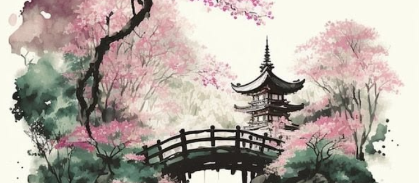

<!-- 
  🎨 Somia's GitHub Canvas
  Full-Stack Developer | AI & Data Science Student | Graphic Designer
-->

<div align="center">

  <!-- 🌸 WATERCOLOR BANNER 🌸 -->
  <!-- Upload your custom watercolor banner to this repo as 'header.png' -->
  

  <br><br>

  <!-- ✨ INTRODUCTION ✨ -->
  <p>
    I am a <strong>Full-Stack Developer</strong>, an <strong>AI & Data Science Student</strong>, and a <strong>Graphic Designer</strong>. 
    I believe that building software is an art form. Just like a watercolor painting, a great application requires balance, structure, and a touch of soul. 
    When I'm not training models or writing code, I pick up my stylus to paint and design.
  </p>

  <br>

  <!-- 💻 THE ARTIST'S CODE 💻 -->
  <h3>🎨 The Artist's Code</h3>
  <div align="left">
  
  ```jsx
  // A React component representing my dual nature
  import { useState } from 'react';

  const Soumia = () => {
    const [inspiration, setInspiration] = useState("Overflowing");
    
    const tools = {
      development: ["React", "Node.js", "Python", "JavaScript", "Tailwind CSS", "Docker", "Git"],
      design: ["Figma", "Photoshop", "Illustrator"],
      ai_ml: ["Data Science", "Machine Learning"]
    };

    const relax = () => {
      console.log("Switching from VS Code to Canvas... 🎨");
      return "Painting or designing a new concept.";
    };

    return (
      <div className="portfolio">
        <h1>Hello, I'm Somia 🌸</h1>
        <p>I craft full-stack applications and design visual experiences.</p>
        <p>Currently studying AI & Data Science to add intelligence to my creations.</p>
        
        <button onClick={() => setInspiration("Collaborating with you!")}>
          Let's build something beautiful
        </button>
      </div>
    );
  };

  export default Suomia;
</div> <br> <!-- 🖌️ THE PALETTE (SKILLS) 🖌️ --> <h3>🖌️ My Palette & Tools</h3> <p> <strong>The Code</strong><br>     <br>     </p> <p> <strong>The Canvas</strong><br>    </p> <br> <!-- 📊 THE GALLERY (STATS) 📊 --> <h3>📖 My Journey in Numbers</h3> <p> <a href="https://github.com/somiaamari">  </a> <a href="https://github.com/somiaamari">  </a> </p> <br> <!-- 📫 CONNECT 📫 --> <h3>🤝 Let's Create Something Beautiful</h3> <p> <a href="https://www.linkedin.com/in/amari-soumia-5a2521291">  </a> <a href="https://www.behance.net/somiaamari">  </a> <a href="mailto:amarisoumia11405@gmail.com">  </a> </p> <br> <!-- 💌 VISITOR COUNTER 💌 --> <p>  </p> <br> <p><em>"Code is my medium, and the screen is my canvas."</em></p></div> ```
