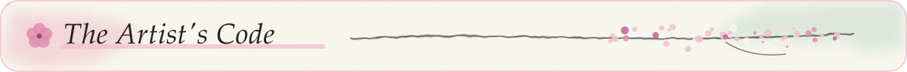
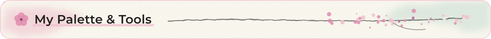
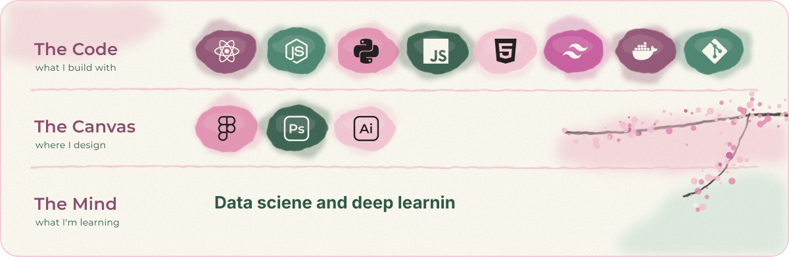
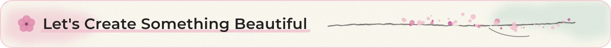

<!--
  🌸 Soumia Amari — GitHub profile

-->

<div align="center">



<br><br>

I build software the way I paint: structure first, then a little soul on top.<br>
By day I write full-stack applications and train models. Between commits, I pick up my stylus to design and paint.

<br>

<a href="https://www.linkedin.com/in/amari-soumia-5a2521291"></a>
<a href="https://www.behance.net/somiaamari"></a>
<a href="mailto:amarisoumia11405@gmail.com"></a>

<br><br>



</div>

```jsx
import { useState } from "react";

const soumia = {
  roles: ["Full-Stack Developer", "AI & Data Science Student", "Graphic Designer"],
  code: ["React", "Node.js", "Python", "JavaScript", "HTML5", "Tailwind CSS", "Docker", "Git"],
  canvas: ["Figma", "Photoshop", "Illustrator"],
  mind: ["Data Science", "Machine Learning"],
  palette: { paper: "#FBFAF0", sakura: "#F3C4D2", plum: "#8A4A6C", jade: "#3E7D67" },
};

export default function Soumia() {
  const [inspiration, setInspiration] = useState("Overflowing");

  const unwind = () => {
    console.log("Leaving VS Code for the canvas... 🌸");
    return "Painting, or designing something new.";
  };

  return (
    <main className="portfolio">
      <h1>Hello, I'm Soumia 🌸</h1>
      <p>I craft full-stack applications and design visual experiences.</p>
      <p>Currently studying AI & Data Science to add intelligence to my creations.</p>
      <p>Inspiration: {inspiration}</p>

      <button onClick={() => setInspiration("Collaborating with you!")}>
        Let's build something beautiful
      </button>
      <button onClick={unwind}>Take a break</button>
    </main>
  );
}
```

<br>

<div align="center">



<br>



<br><br>



<br><br>

<a href="https://www.linkedin.com/in/amari-soumia-5a2521291"></a>
<a href="https://www.behance.net/somiaamari"></a>
<a href="mailto:amarisoumia11405@gmail.com"></a>

<br><br>



<br>


</div>
